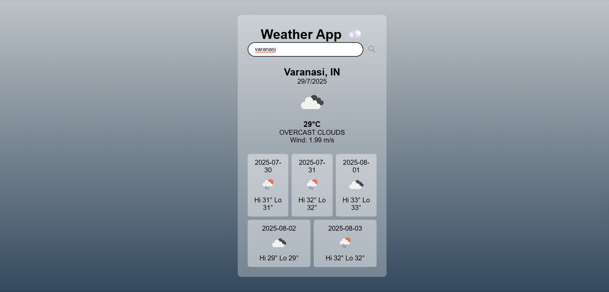

🌤️ Weather App
A responsive and stylish weather application built using Vite + React that displays current weather conditions and a 5-day forecast for any city using the OpenWeatherMap API.

🚀 Features
🔍 Search for any city in the world

🌡️ View current temperature, humidity, wind speed, and weather conditions

🗓️ 5-Day weather forecast (with icons and min/max temperature)

🎨 Dynamic background based on weather (Rain, Clouds, Clear, etc.)

💻 Fully responsive on mobile and desktop

🎬 Smooth fade-in transitions when data loads

❗ Graceful error handling for wrong city names

🛠️ Tech Stack
Frontend: React (with Vite)

Styling: CSS3 (custom styles + media queries)

API: OpenWeatherMap (Current + Forecast endpoint)

🖼️ Screenshots

🧠 Inspiration
This app is inspired by modern weather dashboards with minimalistic design and functional UI. It’s great for practicing React, API integration, and responsive CSS.